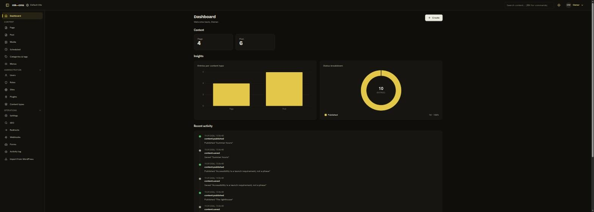
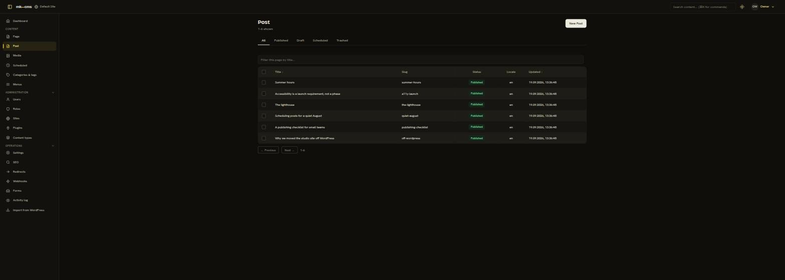
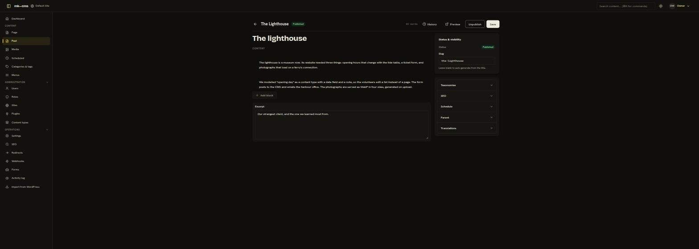

# mk-cms

A **headless, multi-tenant CMS** for people who build websites for others:
one deployment holds the content of any number of sites, editors get a calm
admin, and each site is its own static or server-rendered front-end that
reads a published-only GraphQL API. A WordPress alternative that keeps the
two jobs WordPress mixes — managing content and serving pages — apart.

<picture>
  
</picture>

| | |
| --- | --- |
|  |  |

- **Content is data-defined.** Content types and their fields are rows, not
  code: add a "Product" type with a price, a gallery and a relation to
  "Category" from the admin, and the editor renders it. Thirteen field
  types, revisions with diff, scheduled publishing, translations, hierarchy.
- **Many sites, one instance.** Row-level tenant isolation on `site_id`; one
  admin that switches sites; per-site users and roles with capability-based
  RBAC.
- **Extensible at runtime.** A typed hook bus (actions and filters), a plugin
  engine with lifecycle and settings schemas, webhooks with a job queue.
- **The parts a real site needs, first-party:** media library with responsive
  WebP variants (local or S3/MinIO), menus, redirects, SEO + sitemap/robots,
  forms with e-mail, Postgres full-text search, audit log, a WordPress WXR
  importer, and a public delivery API with preview tokens.
- **Boring, solid stack.** NestJS 11 + Apollo (code-first GraphQL), TypeORM +
  PostgreSQL (JSONB for the flexible layer), Redis + BullMQ, argon2id + JWT.
  Admin: Angular 22 (standalone, zoneless, signals) on
  [`@mk-kit/ui`](https://github.com/mk-kit/mk-kit). One Docker image.

## Try it in two minutes

```bash
git clone https://github.com/mkornas/mk-cms && cd mk-cms
SEED_DEMO=true docker compose -f docker/docker-compose.yml --profile full up -d
```

Open <http://localhost:4000> and sign in as `owner@mk-cms.local` /
`changeme123`. `SEED_DEMO` imports a small fictional studio site — four
pages, six posts, categories and tags — so there is something to click.
The delivery API is open on the same origin:

```bash
curl -s localhost:4000/graphql -H 'content-type: application/json' -H 'x-site: default' \
  -d '{"query":"{ delivery { entries(type:\"post\", limit: 3){ title slug } } }"}'
```

For anything beyond a look around, set `JWT_ACCESS_SECRET`,
`JWT_REFRESH_SECRET` and `SEED_OWNER_PASSWORD` (`openssl rand -base64 32`);
`NODE_ENV=production` refuses the defaults.

## Develop

Requires Node 22+, pnpm (`corepack enable`) and Docker.

```bash
pnpm install
pnpm infra:up            # Postgres + Redis (+ MinIO) in Docker
cp .env.example .env
pnpm api:dev             # API on :4000 — migrations run on boot, first boot seeds the owner
pnpm admin:dev           # admin on :4300, /graphql and /media proxied to the API
pnpm --filter @mk-cms/api test
```

- Health: `GET /health`. GraphQL + Apollo Sandbox (dev): `/graphql`.
- Every request selects a tenant with the `x-site` header (slug, id, or a
  known host). Admin operations also need a bearer token from the `login`
  mutation; the `delivery` subtree is public and published-only.

## How it fits together

```
editor ──> admin SPA ──> /graphql (admin fields: JWT + capabilities)
                              │
                              ├── content.afterPublish ──> webhook ──> rebuild the site
                              │
visitor ──> www.client-a.example (static, on a CDN) ── build reads ──> /graphql { delivery { … } }
                 └── forms, live search ──> the only browser → CMS traffic
```

The CMS never renders public HTML. Each site is a front-end of its own
(static-first is the recommendation — see `docs/HOSTING.md`), rebuilt by a
publish webhook; visitors touch the CMS only for form posts and search.

## Documentation

- [`docs/ARCHITECTURE.md`](docs/ARCHITECTURE.md) — the design, the decisions and their reasons
- [`docs/API.md`](docs/API.md) — the GraphQL surfaces (admin and delivery), auth, tenancy
- [`docs/HOSTING.md`](docs/HOSTING.md) — delivering tenant sites: static-first, webhooks, CORS
- [`docs/ADMIN-UI-GUIDE.md`](docs/ADMIN-UI-GUIDE.md) — how the admin is built on mk-kit
- [`docs/ROADMAP.md`](docs/ROADMAP.md) — what is next
- [`apps/admin/README.md`](apps/admin/README.md) — the admin app in detail

## Repository layout

```
apps/api/            NestJS backend
  src/
    config/ database/ redis/ health/     platform
    tenancy/ users/ auth/ rbac/ options/ multi-tenant foundation
    content/ taxonomy/                   content engine (types, fields, entries, revisions)
    hooks/ plugins/                      hook bus + plugin engine
    api/                                 GraphQL surfaces (admin + delivery)
    audit/ redirects/ seo/ menus/        first-party modules
    webhooks/ jobs/ mail/ forms/ importer/ media/ search/
    bootstrap/                           first-run seed (+ the demo site)
apps/admin/          Angular admin (mk-kit, Apollo Client, ngrx SignalStore)
docker/              compose + the one-image Dockerfile
docs/                architecture, API, hosting, roadmap, screenshots
```

## Status

Backend phases 0–5 and the admin (phase 6) are complete and tested end to
end; a commerce plugin (phase 7) is not started. Used in production? Not
yet — it is published so that it can be. Issues and PRs welcome; see
`CONTRIBUTING.md`.

## License

[AGPL-3.0](LICENSE). Run it, change it, host it for clients; if you offer a
modified version as a service, share the changes.
